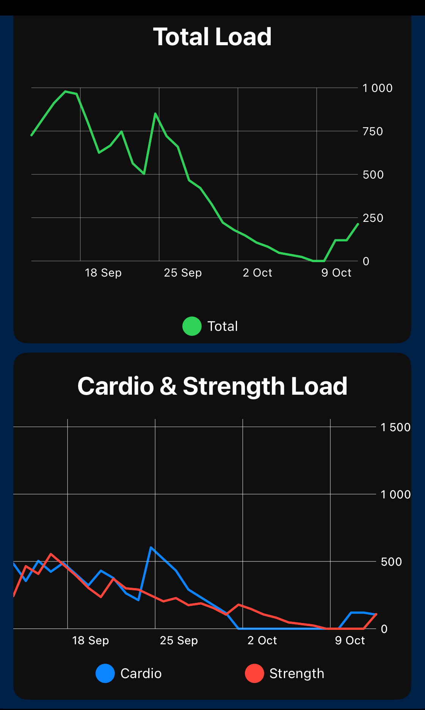

  
  <h1 style="margin-left: 12px;">This is a title</h1>

## Features

  

    
  

  

    <h3>Training Load</h3>
    
Monitor your training load induced by cardio or strength training.

  

<!-- Add more feature sections as needed -->
